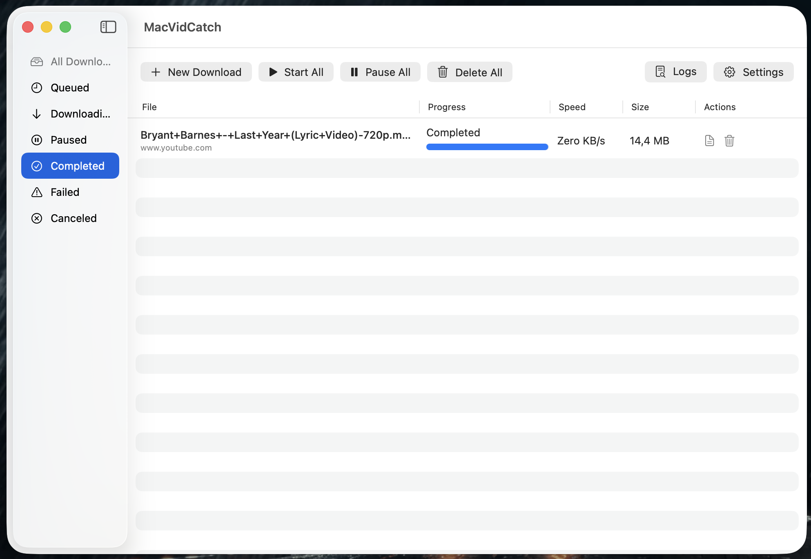
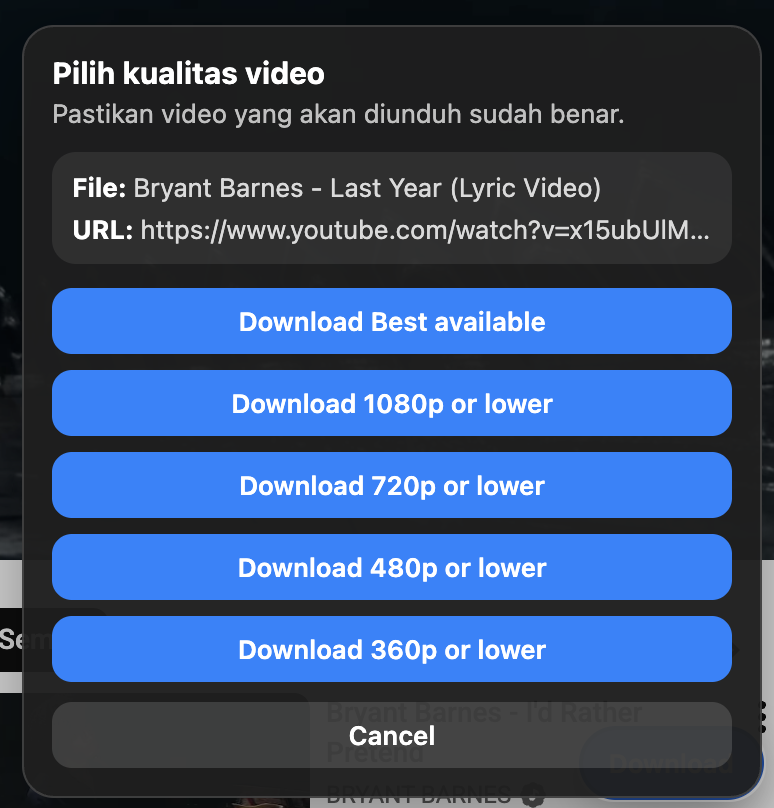

# MacVidCatch

MacVidCatch is a native macOS 13+ Internet Download Manager with browser integration. The user-facing app name, `.app` bundle, DMG volume, Swift package, and executable target all use `MacVidCatch`.

## Screenshots

### MacVidCatch App



### Browser Floating Button



## Current Status

- SwiftUI macOS app with a downloads list, status filters, manual download dialog, Settings, menu bar controls, and a button to open the logs folder.
- Native HTTP/HTTPS downloader with metadata probing via `HEAD`, HTTP status validation, retry, partial-file pause/resume, partial cleanup, final file-size validation, and segmented downloads when the server supports `Accept-Ranges: bytes`.
- Download queue with global parallel download limits and per-file connection limits.
- Basic global speed limiting for the native single-download path.
- Local persistence for jobs and settings under Application Support.
- Custom URL scheme integration via `macvidcatch://download?...` for URLs sent by browser extensions.
- Browser-extension downloads, HLS `.m3u8`, and YouTube URLs are routed through `yt-dlp`; normal manual direct HTTP downloads continue to use the native downloader unless the URL or MIME type indicates HLS.
- Chrome Manifest V3 and Firefox WebExtensions connectors for detecting direct media, HLS playlists, YouTube pages, quality selection, and opening the app via the URL scheme.
- Diagnostic logging for app/download lifecycle, external tool commands, exit status, and per-job `yt-dlp`/`ffmpeg` output.
- Local scripts for building the `.app` bundle and creating a DMG.

## Requirements

- macOS 13 or later.
- Xcode Command Line Tools / Swift Package Manager with Swift 6 support.
- Optional runtime dependencies for browser video and HLS downloads:

```bash
brew install yt-dlp aria2 ffmpeg
```

MacVidCatch searches for `yt-dlp`, `aria2c`, and `ffmpeg` in common paths such as `/opt/homebrew/bin`, `/usr/local/bin`, `/usr/bin`, `/bin`, `/opt/homebrew/opt/node/bin`, and `/usr/local/opt/node/bin`. `aria2c` is used by `yt-dlp` as the external downloader on the main path. `ffmpeg` is used to remux HLS MPEG-TS output to MP4 when needed.

## Build And Run

Run commands from the `app/` directory:

```bash
swift build -c release
./scripts/build_app.sh
open ".build/release/MacVidCatch.app"
```

`./scripts/build_app.sh` runs a release build, retries after clearing Swift `ModuleCache` if the first build fails, creates `.build/release/MacVidCatch.app`, copies the `MacVidCatch` executable, and writes `Info.plist` including the `macvidcatch` URL scheme.

## Create A DMG

Run commands from the `app/` directory:

```bash
./scripts/build_app.sh
./scripts/create_dmg.sh
```

Default output:

```text
.build/release/MacVidCatch.dmg
```

The DMG volume name is `MacVidCatch`. The script also creates an `Applications` symlink in the staging folder.

Signing and notarization require an Apple Developer ID:

```bash
codesign --deep --force --options runtime --sign "Developer ID Application: YOUR NAME" ".build/release/MacVidCatch.app"
xcrun notarytool submit ".build/release/MacVidCatch.dmg" --keychain-profile YOUR_PROFILE --wait
xcrun stapler staple ".build/release/MacVidCatch.dmg"
```

## How Downloads Work

### Native HTTP/HTTPS

The native path is used for normal manual downloads.

- The app sends a `HEAD` request to resolve the file name, file size, final URL, and resume support.
- If the file supports range requests, is larger than 1 MiB, and `maxConnectionsPerFile > 1`, the app uses segmented download.
- Otherwise, the app uses a single stream download with a partial file.
- Partial files are stored under the temporary directory `MacVidCatch/<job-id>/` and cleaned up on cancel/delete/retry.
- The final file is validated against `Content-Length` when the size is known.

### Browser Video / HLS / YouTube

The `yt-dlp` path is used for downloads from browser extensions, `.m3u8` URLs, HLS MIME types, and YouTube URLs.

- The app shows a native save dialog when it receives a browser deep link.
- The app runs `yt-dlp` with the originating page referer when available.
- The app applies a browser-specific user agent based on the source browser (`chrome` or `firefox`).
- The app attempts to use cookies from the configured browser profile.
- The app uses `aria2c` as the external downloader on the main path.
- For HLS, the app uses MPEG-TS handling and then remuxes to MP4 with `ffmpeg` if the output is detected as MPEG-TS.
- `yt-dlp` `[download]` output is parsed to update progress, total size, and speed in the UI.
- For known YouTube failure modes, the app retries with alternate extractor/client settings or without the external downloader and with more conservative formats.

Quality selected in the extension is passed to `yt-dlp` as a format selector. For example, `720` means the best format with height `<=720`; `best` leaves format selection to `yt-dlp`.

## Browser Integration

The app registers this URL scheme in the bundle `Info.plist`:

```text
macvidcatch://download?url=...
```

Query parameters used by the app:

- `url` — required media or page URL to download.
- `pageUrl` — optional originating page URL for the `yt-dlp` referer.
- `title` — optional suggested display/output name.
- `mimeType` — optional media type used to choose the native or `yt-dlp` path.
- `browser` — optional source browser hint such as `chrome` or `firefox`.
- `quality` — optional preferred quality, either `best` or a height such as `1080`, `720`, `480`, or `360`.

### Chrome Extension

1. Open `chrome://extensions`.
2. Enable **Developer Mode**.
3. Choose **Load unpacked**.
4. Select `BrowserExtension/chrome`.
5. When direct media, HLS, or a YouTube page is detected, use the MacVidCatch floating button.

### Firefox Extension

1. Open `about:debugging#/runtime/this-firefox`.
2. Choose **Load Temporary Add-on…**.
3. Select `BrowserExtension/firefox/manifest.json`.
4. When direct media, HLS, or a YouTube page is detected, use the MacVidCatch floating button.

## Settings

Settings are automatically saved to JSON under Application Support.

Available app settings:

- Default download folder.
- Max simultaneous downloads.
- Max connections per file.
- Retry count and retry interval.
- Global speed limit in bytes/second; `0` means unlimited.
- Notifications toggle.
- Floating button preference toggle.
- Browser cookies/profile path.
- Domain allowlist and blocklist.

`Browser cookies/profile path` accepts a `Profiles` folder, a specific profile folder, a `cookies.sqlite` file, or a Chromium-style profile folder containing `Cookies`. Default detection checks common Firefox, Firefox Developer Edition, LibreWolf, Waterfox, Chrome, Chromium, Edge, and Brave locations.

Note: extension allowlist/blocklist settings are applied before a candidate is sent to the app. On the app side, the currently enforced policy during enqueue is the domain blocklist.

## Logging And Data

MacVidCatch stores app data under its Application Support folder:

```text
~/Library/Application Support/MacVidCatch/
```

Data files:

- `downloads.json` — download job list.
- `settings.json` — app settings.

Logs are written to:

```text
~/Library/Application Support/MacVidCatch/Logs/
```

Log files:

- `app.log` — global app and download lifecycle events.
- `download-<UUID>.log` — per-job output from `yt-dlp`/`ffmpeg` and related command details.

Use the **Logs** button in the UI to open the logs folder.

Command logs redact common sensitive URL query parameters such as `token`, `signature`, `sig`, `policy`, `key`, and `jwt`. Upstream output from `yt-dlp`/`ffmpeg` is still stored for diagnostics, so review logs before sharing them.

## Validation

There is currently no dedicated test suite. Validate code changes with:

```bash
swift build -c release
```

If changes affect the app bundle, URL scheme, or packaging, also run:

```bash
./scripts/build_app.sh
```

## Compliance And Safety

MacVidCatch is intended only for downloads the user is authorized to access and save. The app and extensions do not implement DRM, paywall, encryption, or access-control bypasses.

Current safety behavior:

- Extensions detect common direct media such as `.mp4`, `.mov`, `.webm`, `.m4v`, HLS `.m3u8`, and supported YouTube pages for `yt-dlp` handling.
- Extensions perform best-effort DRM detection from response headers and markers such as `keyformat`, `widevine`, `playready`, and `fairplay`.
- If media appears protected, the floating button is not shown and the user receives an explanatory notice.
- Extensions honor local blocklist and allowlist-mode settings before sending candidates to the app.
- The app honors the persisted domain blocklist when enqueuing jobs.
- Cookies/referer are used only for content the user is authorized to access through their local browser profile.

DRM and policy safeguards are conservative and best-effort; they are not a guarantee that every protected stream can be identified. Users are responsible for following source-site terms and downloading only content they are allowed to save.
